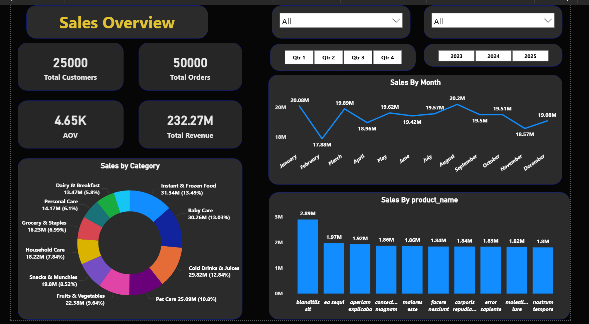
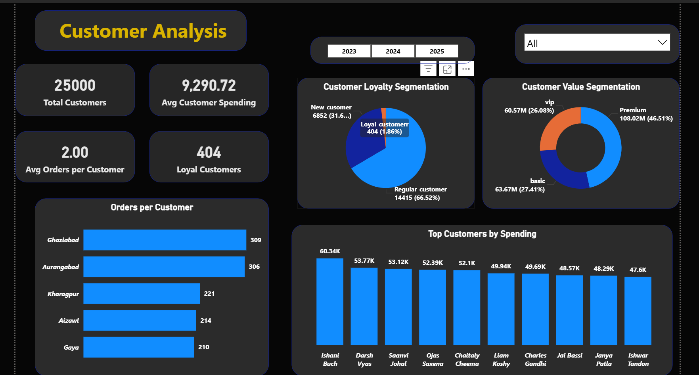
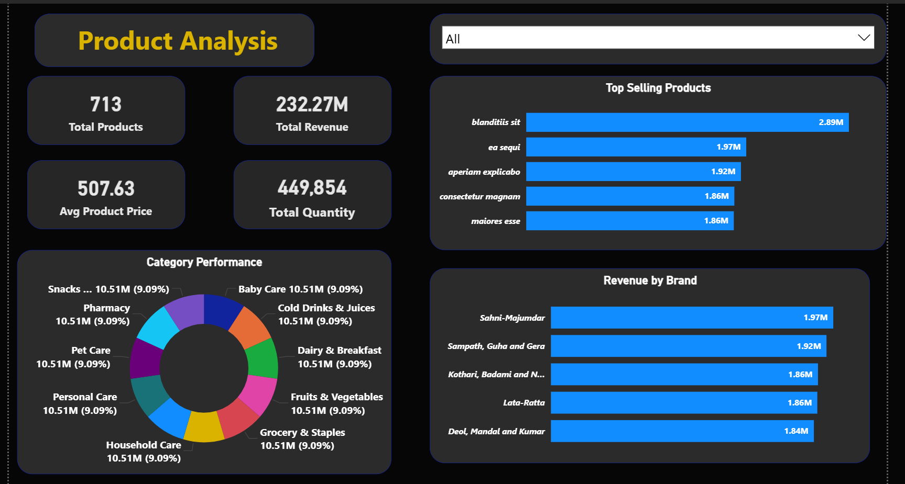
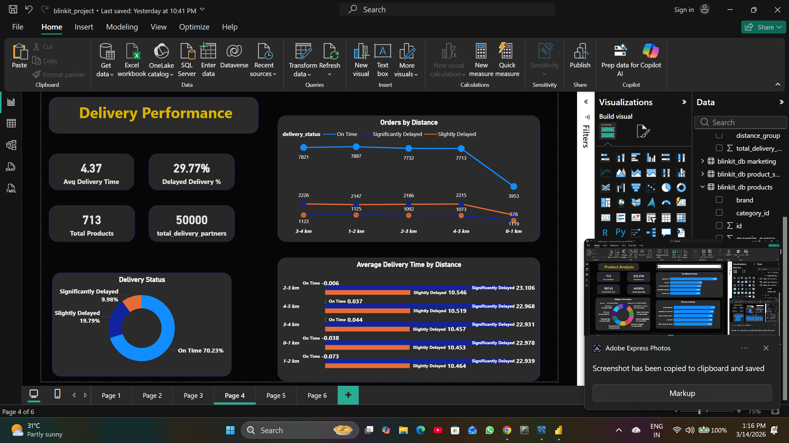
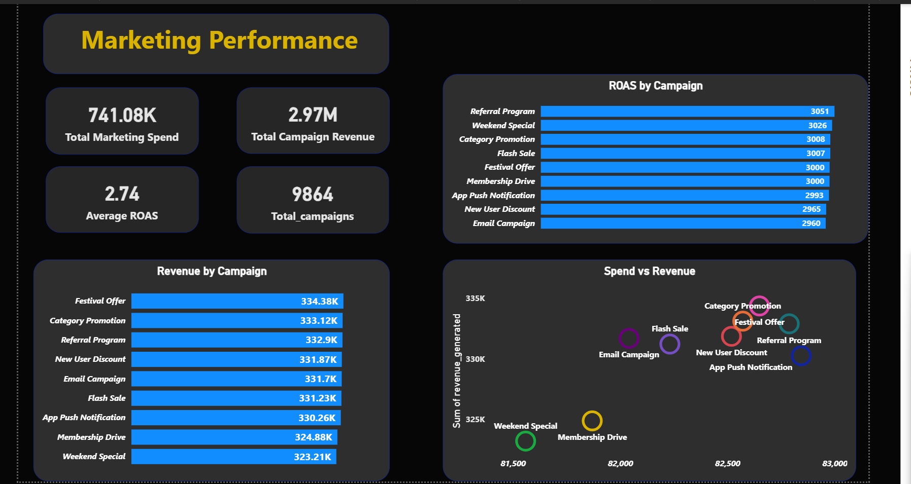
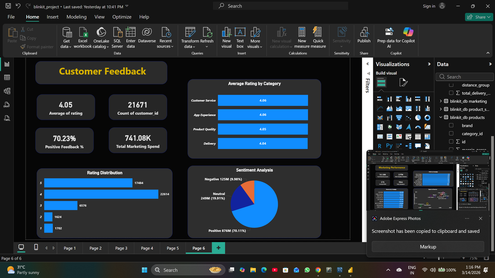

# 📊 Blinkit Business Intelligence Dashboard — Power BI

> An interactive 6-page Power BI dashboard built on Blinkit's dataset of **25,000 customers** and **50,000 orders**, delivering end-to-end business insights across sales, customers, products, delivery, marketing, and feedback.

---

## 🖼️ Dashboard Preview

### Page 1 — Sales Overview


### Page 2 — Customer Analysis


### Page 3 — Product Analysis


### Page 4 — Delivery Performance


### Page 5 — Marketing Performance


### Page 6 — Customer Feedback


---

## 📌 Project Overview

Blinkit (formerly Grofers) is one of India's leading quick-commerce grocery delivery platforms. This project performs a complete **Business Intelligence Analysis** using Power BI — covering everything from sales trends to customer sentiment.

---

## 📈 Dashboard Pages — 6 Interactive Reports

### 🏪 Page 1 — Sales Overview
| Metric | Value |
|---|---|
| Total Customers | 25,000 |
| Total Orders | 50,000 |
| Total Revenue | ₹232.27M |
| Average Order Value | ₹4,650 |

Key Visuals:
- Sales by Month trend line
- Sales by Category donut chart
- Top Products by Revenue bar chart
- Quarter & Year filters

---

### 👥 Page 2 — Customer Analysis
| Metric | Value |
|---|---|
| Total Customers | 25,000 |
| Avg Customer Spending | ₹9,290.72 |
| Avg Orders per Customer | 2.00 |
| Loyal Customers | 404 |

Key Visuals:
- Customer Loyalty Segmentation (New / Loyal / Regular)
- Customer Value Segmentation (VIP / Premium / Basic)
- Orders per Customer by City
- Top Customers by Spending

---

### 📦 Page 3 — Product Analysis
| Metric | Value |
|---|---|
| Total Products | 713 |
| Total Revenue | ₹232.27M |
| Avg Product Price | ₹507.63 |
| Total Quantity Sold | 4,49,854 |

Key Visuals:
- Top Selling Products bar chart
- Category Performance donut chart
- Revenue by Brand bar chart

---

### 🚴 Page 4 — Delivery Performance
| Metric | Value |
|---|---|
| Avg Delivery Time | 4.37 mins |
| Delayed Delivery % | 29.77% |
| On Time Delivery % | 70.23% |
| Total Delivery Partners | 50,000 |

Key Visuals:
- Orders by Distance (On Time vs Delayed)
- Delivery Status donut chart
- Average Delivery Time by Distance

---

### 📢 Page 5 — Marketing Performance
| Metric | Value |
|---|---|
| Total Marketing Spend | ₹7,41,080 |
| Total Campaign Revenue | ₹29.7M |
| Average ROAS | 2.74 |
| Total Campaigns | 9,864 |

Key Visuals:
- ROAS by Campaign bar chart
- Revenue by Campaign
- Spend vs Revenue scatter plot
- Top Campaign: Referral Program (ROAS: 3051)

---

### ⭐ Page 6 — Customer Feedback
| Metric | Value |
|---|---|
| Average Rating | 4.05 |
| Total Feedbacks | 21,671 |
| Positive Feedback % | 70.23% |

Key Visuals:
- Average Rating by Category
- Rating Distribution bar chart
- Sentiment Analysis pie chart (70% Positive)

---

## 💡 Key Business Insights

- 🛒 **Instant & Frozen Food** is the top revenue category (13.49%)
- 🚴 **70.23%** deliveries are completed on time
- 📢 **Referral Program** has the highest ROAS of 3051
- ⭐ **70%** of customer feedback is Positive
- 💰 **Baby Care** generates strong revenue at 13.03%
- 👥 Only **1.86%** customers are classified as Loyal — retention opportunity!

---

## 🛠️ Tools & Technologies


- **Tool:** Microsoft Power BI Desktop
- **Data Source:** MySQL (blinkit_db)
- **Concepts:** DAX Measures, Slicers, Filters, Drill-through, KPI Cards
- **Pages:** 6 Interactive Dashboard Pages

---

## 📁 File Structure

```
📁 Blinkit_PowerBI_Dashboard/
│
├── 📄 README.md                  ← Project overview (this file)
├── 📊 blinkit_project.pbix       ← Power BI Dashboard file
├── 🖼️ sales_overview.png         ← Page 1 screenshot
├── 🖼️ customer_analysis.png      ← Page 2 screenshot
├── 🖼️ product_analysis.png       ← Page 3 screenshot
├── 🖼️ delivery_performance.png   ← Page 4 screenshot
├── 🖼️ marketing_performance.png  ← Page 5 screenshot
└── 🖼️ customer_feedback.png      ← Page 6 screenshot
```

---

## 🔗 Related Project

📌 **SQL Analysis Project:** [Blinkit SQL Business Intelligence Analysis](https://github.com/kumarpradeepnalot9828-bot/Blinkit_SQL_Analysis)

> Same dataset analyzed using 61 SQL queries across 7 modules!

---

## 🚀 How to Open

1. Download `blinkit_project.pbix`
2. Open with **Power BI Desktop** (Free download from Microsoft)
3. Explore all 6 dashboard pages!

---

## 👨‍💻 Author

**Pradeep Kumar**
Aspiring Data Analyst | SQL | Power BI | MySQL
📧 [kumarpradeepnalot9828@gmail.com]
🔗 [https://www.linkedin.com/in/pradeep-kumar-50b03a2b5/]

---

## ⭐ If you found this project helpful, please give it a star!
